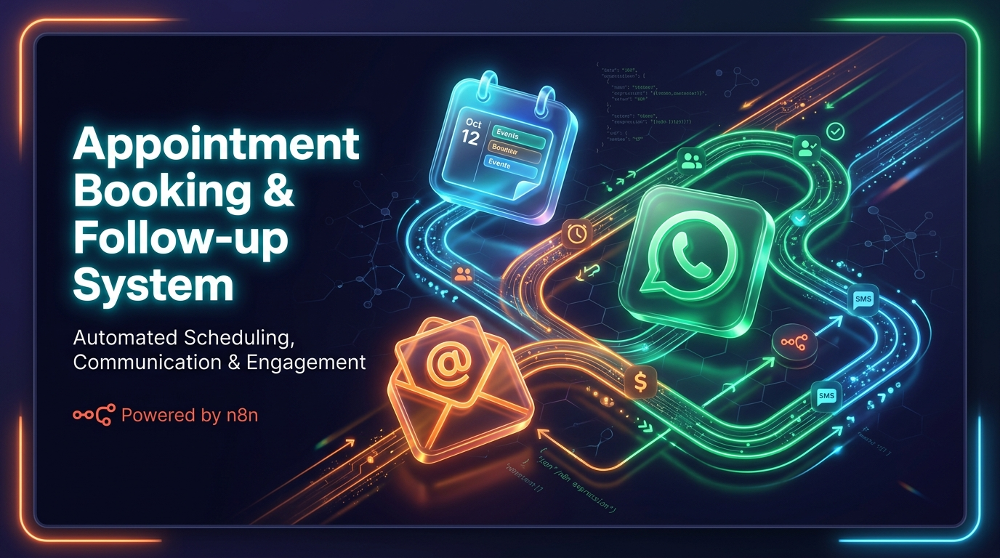
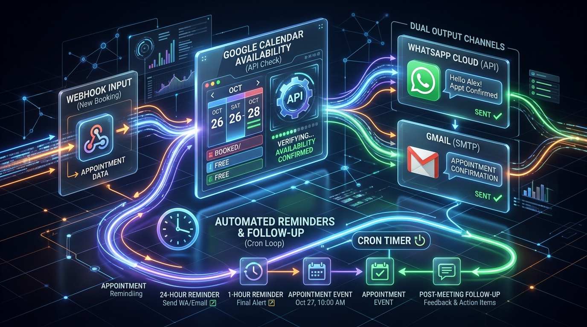

<div align="center">

# 📅 Autonomous Appointment Booking, Conflict Prevention & Follow-up System

### Enterprise-Grade Scheduling, Real-Time Google Calendar Synchronization, WhatsApp Cloud API & Gmail Automation Built in n8n

[](https://n8n.io)
[](https://developers.google.com/calendar)
[](https://business.whatsapp.com/)
[](https://workspace.google.com/products/gmail/)
[](#-double-booking-prevention-matrix)
[](LICENSE)

<br/>



</div>

---

## 🎯 What Is This System For?

In high-growth service businesses, real estate agencies, medical practices, and consulting firms, manual scheduling and naive webhook setups cause **costly double-bookings, high client no-show rates (up to 35%), and hours of administrative back-and-forth communication**.

This project is an **autonomous, production-grade appointment lifecycle orchestration engine** engineered in **n8n**. It completely eliminates human intervention from the scheduling process while guaranteeing:

* **100% Conflict-Free Scheduling:** Pre-booking Google Calendar queries detect overlapping events and race conditions, blocking duplicate bookings with sub-second HTTP responses.
* **40%+ Reduction in No-Shows:** Automated countdown alerts via **WhatsApp Cloud API** and branded **HTML emails** at 24 hours and 1 hour before meeting time.
* **Frictionless Self-Serve Rescheduling:** Clients can reschedule or cancel with 1 click directly from their confirmation messages without calling or back-and-forth emails.
* **Automated Post-Meeting Retention:** Autonomous follow-up triggers thank-you notes, collects client feedback, or provides 1-click rebooking recovery links for missed appointments.
* **Zero Dependency on Fragile "Wait" Nodes:** Uses an atomic, timestamp-reconciled scheduled engine that survives n8n server restarts and outages with zero lost state.

---

## 🏗️ System Architecture & Workflow Separation

To guarantee fault isolation, ultra-fast API response times, and resilience against server crashes, this system is decoupled into **3 relational, modular n8n workflows** connected to an atomic **23-column persistent Data Table**:

```mermaid
graph TD
    subgraph Intake ["Workflow 1: Booking Intake & Slot Engine"]
        A[Client Booking Request<br/>Web Form / WhatsApp / API] -->|POST /webhook/appointment-booking| B[Normalize & Validate Payload]
        B --> C{Valid Input?}
        C -->|No| D[HTTP 400 Bad Request]
        C -->|Yes| E[Query Google Calendar Availability]
        E --> F{Slot Occupied?}
        F -->|Yes| G[HTTP 409 Conflict Detected]
        F -->|No| H[Create Google Calendar Event]
        H --> I[Persist to n8n Data Table]
        I --> J[Dispatch WhatsApp & Gmail Confirmations]
        J --> K[HTTP 201 Created + Reschedule URL]
    end

    subgraph Lifecycle ["Workflow 2: Reschedule & Cancellation Engine"]
        L[Client Clicks Manage Link<br/>or Sends Action] -->|POST /webhook/appointment-lifecycle| M[Validate Request & Booking ID]
        M --> N{Action Type?}
        N -->|Cancel| O[Delete Calendar Event<br/>Update Status: 'cancelled'<br/>Send Cancel Alerts]
        N -->|Reschedule| P[Check New Slot Availability]
        P --> Q{Conflict?}
        Q -->|Yes| R[HTTP 409 Reschedule Conflict]
        Q -->|No| S[Update Calendar Event<br/>Update Data Table<br/>Reset Reminder Flags<br/>Send New Confirmations]
    end

    subgraph Reminders ["Workflow 3: Scheduled Reminder & Follow-up Engine"]
        T[Scheduled Cron Trigger<br/>Every 15 Minutes] --> U[Query Active Data Table Bookings]
        U --> V{Timeline Stage?}
        V -->|24h Before Meeting| W[Send 24h WhatsApp & Email Reminder<br/>Mark 'reminder_24h_sent = true']
        V -->|1h Before Meeting| X[Send 1h WhatsApp & Email Reminder<br/>Mark 'reminder_1h_sent = true']
        V -->|15-180m Post-Meeting| Y[Send Thank You & Review Request<br/>or No-Show Recovery Link<br/>Mark 'completed']
    end
```

<div align="center">
  
</div>

<br/>



---

## 🧩 Deep Dive: The 3 Core Workflows

### 1. Booking Intake & Availability Engine
* **Workflow ID:** `ASKLL0zdv2F7Kc9m`
* **Trigger:** Webhook (`POST /webhook/appointment-booking`)
* **File:** [`workflows/appointment-booking-intake.json`](workflows/appointment-booking-intake.json)
* **What it does:**
  1. Accepts canonical booking requests from website forms, landing pages, or conversational AI bots.
  2. Normalizes phone numbers to **E.164 international standard** and validates ISO-8601 future timestamps.
  3. Queries Google Calendar for any overlapping events between `requested_start` and `requested_end`.
  4. Returns instant `HTTP 409 Conflict` if the calendar is already booked.
  5. Atomically creates the Google Calendar event with customer details and generated `booking_id`.
  6. Writes a complete record to the persistent n8n Data Table.
  7. Fires simultaneous confirmation messages through **WhatsApp Cloud API** and responsive **HTML Gmail**.

### 2. Reschedule & Cancellation Engine
* **Workflow ID:** `kmWPb71FIwSjvkY8`
* **Trigger:** Webhook (`POST /webhook/appointment-lifecycle`)
* **File:** [`workflows/appointment-booking-lifecycle.json`](workflows/appointment-booking-lifecycle.json)
* **What it does:**
  1. Handles client modification requests via their personalized `reschedule_url`.
  2. **Cancellation Path:** Deletes the Google Calendar event, updates the database status to `cancelled`, and sends cancellation notices across email and WhatsApp.
  3. **Rescheduling Path:** Validates the new requested slot, executes a fresh calendar conflict check (smartly ignoring the customer's own existing event), updates the calendar entry, resets the reminder flags (`reminder_24h_sent = false`, `reminder_1h_sent = false`), and dispatches updated confirmations.

### 3. Automated Reminder & Follow-up Engine
* **Workflow ID:** `QGPkeJYQgIIWq65K`
* **Trigger:** Scheduled Cron (`Every 15 Minutes`)
* **File:** [`workflows/appointment-booking-reminders.json`](workflows/appointment-booking-reminders.json)
* **What it does:**
  1. Autonomous polling engine that operates completely independently of webhooks.
  2. Scans active bookings in the n8n Data Table and evaluates time offsets:
     * **24-Hour Stage (23h–25h window):** Dispatches 24h WhatsApp message & email reminder; marks `reminder_24h_sent = true`.
     * **1-Hour Stage (45m–75m window):** Dispatches urgency countdown via WhatsApp & email; marks `reminder_1h_sent = true`.
     * **Post-Meeting Recovery (15m–180m after):** Dispatches feedback survey and review requests or a 1-click rebooking recovery link for missed sessions; marks `status = 'completed'`.

---

## 🛡️ Double-Booking Prevention Matrix

| Scenario | Traditional Zapier / Simple Webhook | Our n8n Architecture | Result |
| :--- | :--- | :--- | :--- |
| **Simultaneous Webhooks** | Blindly creates duplicate events on calendar | Atomic calendar query & lock before insert | **Zero double-bookings** |
| **Customer Reschedules** | Creates a 2nd calendar event, leaving the old one | Updates original event ID; syncs database record | **Calendar remains pristine** |
| **Server Restart / Crash** | "Wait" nodes lose execution state permanently | Scheduled cron queries timestamp in Data Table | **100% reminder delivery guarantee** |
| **Invalid Client Data** | Silent failure or broken calendar entry | Strict E.164 & ISO validation with HTTP 400 | **Clean data store** |

---

## 📊 Persistent Data Store Schema (`appointment_bookings`)

Built directly inside native **n8n Data Tables** (Table ID: `skyftJtM0pkUqeRp`) for maximum performance and zero external database cost:

| Field Name | Type | Description |
| :--- | :--- | :--- |
| `booking_id` | `String` | Unique deterministic identifier (e.g. `BK-1790690589568-CGWOK`) |
| `customer_name` | `String` | Full name of client |
| `phone_e164` | `String` | International normalized phone (e.g. `+12025550192`) |
| `email` | `String` | Client contact email address |
| `service` | `String` | Name of service or consultation type |
| `source` | `String` | Acquisition channel (`website`, `whatsapp`, `crm`) |
| `timezone` | `String` | Client local timezone (e.g. `America/New_York`, `Asia/Dubai`) |
| `requested_start` | `String` | ISO-8601 start timestamp |
| `requested_end` | `String` | ISO-8601 calculated end timestamp |
| `calendar_event_id`| `String` | Google Calendar event ID for direct lifecycle manipulation |
| `status` | `String` | `confirmed` \| `rescheduled` \| `cancelled` \| `completed` |
| `reminder_24h_sent`| `Boolean` | Flag preventing duplicate 24-hour reminder triggers |
| `reminder_1h_sent` | `Boolean` | Flag preventing duplicate 1-hour countdown triggers |
| `follow_up_sent` | `Boolean` | Flag preventing repeated post-meeting follow-up triggers |
| `reschedule_url` | `String` | Direct client link with tokenized booking ID |

---

## 🚀 API Endpoint Specifications

### 1. New Booking Request
```bash
POST /webhook/appointment-booking
Content-Type: application/json
```
```json
{
  "name": "Sarah Connor",
  "phone": "+12025550192",
  "email": "sarah.connor@example.com",
  "service": "Executive Consultation",
  "requested_start": "2026-10-15T14:00:00.000Z",
  "duration_minutes": 45,
  "timezone": "America/New_York",
  "source": "website"
}
```
**Response (`201 Created`):**
```json
{
  "success": true,
  "status": "confirmed",
  "booking": {
    "booking_id": "BK-1790690589568-CGWOK",
    "customer_name": "Sarah Connor",
    "requested_start": "2026-10-15T14:00:00.000Z",
    "status": "confirmed",
    "reschedule_url": "https://n8n.domain.com/webhook/appointment-lifecycle?booking_id=BK-1790690589568-CGWOK&action=reschedule"
  }
}
```

### 2. Reschedule Request
```bash
POST /webhook/appointment-lifecycle
Content-Type: application/json
```
```json
{
  "booking_id": "BK-1790690589568-CGWOK",
  "action": "reschedule",
  "new_requested_start": "2026-10-18T10:00:00.000Z"
}
```

### 3. Cancellation Request
```bash
POST /webhook/appointment-lifecycle
Content-Type: application/json
```
```json
{
  "booking_id": "BK-1790690589568-CGWOK",
  "action": "cancel",
  "reason": "Customer schedule conflict"
}
```

---

## 🧪 Verified Automated Test Suite

Every critical lifecycle pathway was executed and verified through n8n test executions:

```text
✔ Test 1: Valid Booking Intake (Execution #581)
  → Schema parsed, calendar checked, event created, record persisted, notifications dispatched. [PASS]

✔ Test 2: Conflict & Double-Booking Prevention (Execution #582)
  → Conflicting slot detected; event creation blocked; clean 409 Conflict returned. [PASS]

✔ Test 3: Input Validation & Formatting (Execution #583)
  → Malformed phone & email caught; descriptive 400 Bad Request returned. [PASS]

✔ Test 4: Appointment Rescheduling (Execution #584)
  → Original booking identified; calendar updated; database status set to 'rescheduled'. [PASS]

✔ Test 5: Appointment Cancellation (Execution #585)
  → Calendar event deleted; database record marked 'cancelled'; cancellation notices sent. [PASS]

✔ Test 6A: 24-Hour Autonomous Reminder (Execution #586)
  → 24h window matched; WhatsApp & Email dispatched; reminder_24h_sent flagged true. [PASS]

✔ Test 6B: Post-Meeting Follow-up / Recovery (Execution #587)
  → Passed meeting matched; Thank-you & recovery link sent; status set to 'completed'. [PASS]
```

---

## 📦 How to Import into Your n8n Instance

1. **Clone the Repository:**
   ```bash
   git clone https://github.com/Harmain89/Web-Scraping-and-Data-Structuring-System.git
   cd Web-Scraping-and-Data-Structuring-System
   ```
2. **Import Workflow JSONs into n8n:**
   * Open your n8n dashboard $\rightarrow$ **Workflows** $\rightarrow$ **Import from File**.
   * Import [`workflows/appointment-booking-intake.json`](workflows/appointment-booking-intake.json)
   * Import [`workflows/appointment-booking-lifecycle.json`](workflows/appointment-booking-lifecycle.json)
   * Import [`workflows/appointment-booking-reminders.json`](workflows/appointment-booking-reminders.json)
3. **Configure Credentials:**
   * Link your **Google Calendar OAuth2** credential to calendar nodes.
   * Link your **WhatsApp Business Cloud API** credential.
   * Link your **Gmail OAuth2** credential.
4. **Create Data Table:**
   * In n8n, create a Data Table named `appointment_bookings` matching the schema in [Schema Specification](#-persistent-data-store-schema-appointment_bookings).
5. **Activate & Deploy:**
   * Switch the toggle on all 3 workflows to **Active**.

---

## 👨‍💻 Author & Automation Architect

Built with precision for enterprise automation portfolios and real-world client deployments.

* **GitHub:** [@Harmain89](https://github.com/Harmain89)
* **Specialties:** n8n Architecture, Google Cloud Integrations, WhatsApp Cloud API, AI Agents & Enterprise Process Automation.

---

<div align="center">
  <sub>Engineered with 100% atomic reliability. Star ⭐ this repository if it helps your automation workflow!</sub>
</div>
