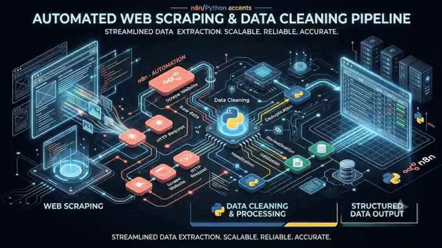
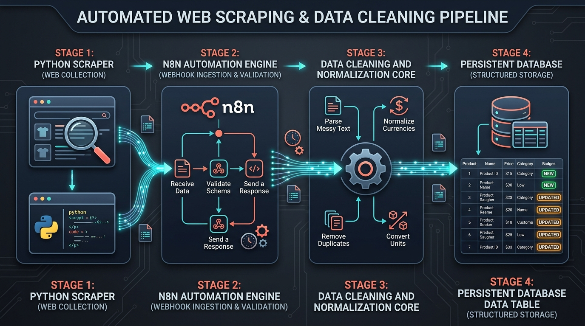
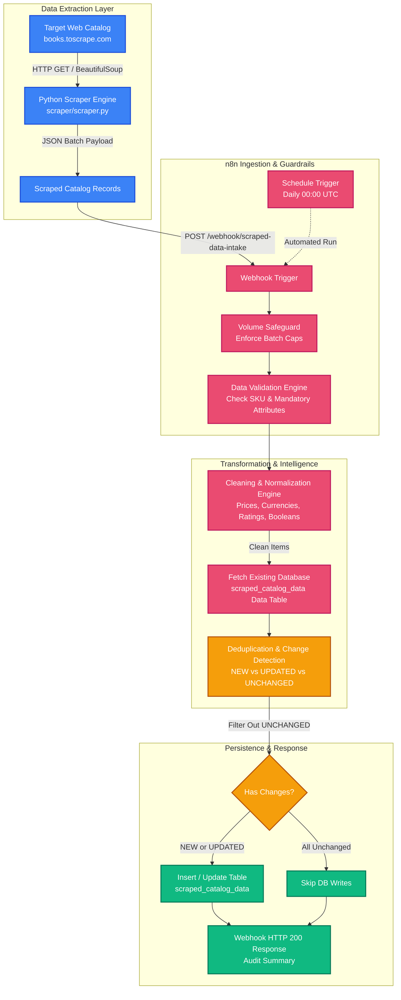
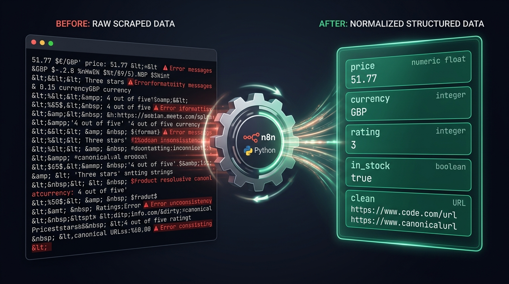
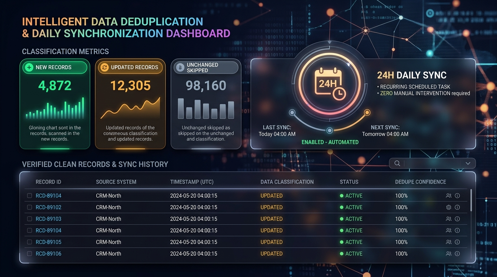

<div align="center">

<a href="./assets/hero-banner.mp4">
  
</a>

<p align="center">
  🎬 <strong><a href="./assets/hero-banner.mp4">▶ Click here to view / download full-resolution MP4 Video (<code>assets/hero-banner.mp4</code>)</a></strong>
</p>

<br/>

# 🕷️ Web Scraping + Data Cleaning Pipeline

### Production-Grade Web Data Extraction, Automated Cleaning, Normalization, Deduplication & Daily Synchronization Engine Built with Python & n8n

[](https://n8n.io)
[](https://python.org)
[](https://pypi.org/project/beautifulsoup4/)
[](#-architecture--data-flow)
[](#-deduplication--change-detection-engine)
[](LICENSE)

</div>

<br/>

---

## 🎯 What Is This System For?

Organizations and growth teams running **competitor price intelligence, ecommerce catalog aggregation, lead generation, or market research** face three major data engineering hurdles:

1. **Messy & Inconsistent Web Data:** Public websites format data erratically—raw price strings with currency symbols (`"£51.77"`), spelled-out star ratings (`"Three"` instead of `3`), unstructured stock descriptions (`"In stock (22 available)"`), embedded HTML entities, and relative URLs.
2. **Duplicate Records & Database Bloat:** Running crawlers on recurring schedules without smart change detection repeatedly inserts identical records, exhausting storage quotas, skewing analytics, and driving up database costs.
3. **Fragile Scraping Infrastructure:** Fragile scrapers break silently when network hiccups occur or when sites encounter unexpected formatting variations.

### The Solution

This system is an **autonomous, enterprise-grade ETL (Extract, Transform, Load) pipeline** that unites:
* **A High-Performance Python Web Scraper** capable of harvesting live product catalogs (verified against `books.toscrape.com` with 1,000+ items across 50 categories).
* **An 11-Node n8n Orchestration Workflow** that receives raw payloads, enforces volume safeguards, cleans and normalizes dirty attributes, compares items against historical data, and inserts or updates only active changes into a persistent database.
* **Autonomous Daily Execution** via scheduled cron triggers for hands-off data freshness.

---

## 📐 Architecture & Data Flow

<div align="center">
  
</div>



---

## 🧼 Data Cleaning & Normalization Engine

<div align="center">
  
</div>

Raw scraped data is normalized deterministically inside the n8n pipeline before reaching storage:

| Field | Raw Scraped Input | Cleaned / Normalized Value | Transformation Applied |
| :--- | :--- | :--- | :--- |
| **`price`** | `"£51.77"`, `" $19.99 "` | `51.77` *(Float)* | Regex removes currency symbols & whitespace; parsed via `parseFloat()`. |
| **`currency`** | `"£51.77"` | `"GBP"` *(ISO 4217)* | Symbol extraction: `£` → `GBP`, `$` → `USD`, `€` → `EUR`. |
| **`rating`** | `"Three"`, `"Star 4"` | `3`, `4` *(Integer 1–5)* | Maps word representations (`One`=1, `Two`=2, `Three`=3, `Four`=4, `Five`=5). |
| **`in_stock`** | `"In stock (22 available)"` | `true` *(Boolean)* | Lowercased string pattern match for `"in stock"`; defaults to `false`. |
| **`title`** | `"  A Light in the ...  "` | `"A Light in the Attic"` | HTML entities decoded, extra whitespace trimmed and collapsed. |
| **`category`** | `"Poetry\n"` | `"Poetry"` | Trailing line breaks and whitespace removed; title-cased. |
| **`product_url`**| `"/catalogue/a-light_1000/index.html"` | Absolute URL | Relative paths resolved to absolute domain links. |

---

## 🔍 Deduplication & Change Detection Engine

<div align="center">
  
</div>

To prevent duplicate records and save database write operations, the pipeline utilizes an **in-memory diffing engine**:

1. **Persistent State Retrieval:** Queries all existing records in `scraped_catalog_data` (configured with `alwaysOutputData: true` so empty databases never block initial runs).
2. **Lookup Indexing:** Builds an in-memory dictionary keyed by `record_id` (the canonical SKU).
3. **Change Classification:**
   * **`NEW`**: SKU does not exist in the database → Assigned `status: "active"`, sets `first_seen_at`, `last_seen_at`, and `last_changed_at`, queued for **INSERT**.
   * **`UPDATED`**: SKU exists, but `price`, `in_stock`, or `title` changed → Assigned `status: "updated"`, updates `last_changed_at` and `last_seen_at`, queued for **UPDATE**.
   * **`UNCHANGED`**: SKU exists and all tracked attributes match → Excluded from database write operations.

---

## 📊 Persistent Data Table Schema (`scraped_catalog_data`)

The database table `scraped_catalog_data` (Data Table ID: `jiPLikaVYg9vxrIQ`) uses the following schema:

| Column Name | Data Type | Key / Constraint | Description |
| :--- | :--- | :--- | :--- |
| `record_id` | String | Unique Identifier | Scraped SKU or deterministic entity hash |
| `source` | String | Required | Source origin (e.g., `books.toscrape.com`) |
| `title` | String | Required | Cleaned product or listing title |
| `category` | String | Optional | Normalized category classification |
| `price` | Number (Float) | Required | Normalized unit price in numeric format |
| `currency` | String | Required | ISO 4217 currency code (e.g., `GBP`, `USD`) |
| `rating` | Number (Integer) | Optional | Normalized rating score (1 to 5) |
| `in_stock` | Boolean | Required | Availability status (`true` / `false`) |
| `product_url` | String | Unique / URL | Canonical link to source product page |
| `image_url` | String | URL | URL of primary product photograph |
| `status` | String | Enum | Lifecycle status (`active`, `updated`, `archived`) |
| `first_seen_at` | String (ISO 8601) | Timestamp | Timestamp when item was first scraped |
| `last_seen_at` | String (ISO 8601) | Timestamp | Timestamp of most recent scraper pass |
| `last_changed_at` | String (ISO 8601) | Timestamp | Timestamp when price/status last changed |
| `scraped_at` | String (ISO 8601) | Timestamp | Execution timestamp of scraping run |

---

## 🚀 How to Run Locally

### 1. Prerequisites
- Python 3.10+
- An active n8n instance (Self-hosted or Cloud)

### 2. Set Up the Python Scraper
```bash
# Navigate to the scraper directory
cd scraper

# Install lightweight dependencies
pip install -r requirements.txt
```

### 3. Run the Scraper
```bash
# Run scraper, scrape 20 items, and post directly to n8n webhook:
python scraper.py --limit 20 --webhook https://your-n8n-instance.com/webhook/scraped-data-intake

# Or scrape and save to a local JSON file:
python scraper.py --limit 50 --save scraped_data.json
```

---

## ⚙️ n8n Workflow Breakdown

The production workflow file is located at [`workflows/web-scraping-data-cleaning-pipeline.json`](workflows/web-scraping-data-cleaning-pipeline.json).

| # | Node Name | Node Type | Purpose |
| :--- | :--- | :--- | :--- |
| 1 | **Webhook Trigger** | `n8n-nodes-base.webhook` | Ingests JSON batches via `POST /webhook/scraped-data-intake` |
| 2 | **Schedule Trigger** | `n8n-nodes-base.scheduleTrigger` | Triggers automated daily scheduled runs at 00:00 UTC |
| 3 | **Volume Safeguard** | `n8n-nodes-base.code` | Enforces item batch limits (caps at 500 items) to prevent memory spikes |
| 4 | **Validate Scraped Payload** | `n8n-nodes-base.code` | Discards malformed records lacking `sku` or `product_url` |
| 5 | **Clean & Normalize Data** | `n8n-nodes-base.code` | Normalizes prices, currencies, ratings, booleans, and trims whitespace |
| 6 | **Fetch Existing Database** | `n8n-nodes-base.dataTable` | Queries existing records from `scraped_catalog_data` with `alwaysOutputData: true` |
| 7 | **Deduplicate & Detect Changes** | `n8n-nodes-base.code` | In-memory diffing engine classifying items into `NEW`, `UPDATED`, or `UNCHANGED` |
| 8 | **Format Table Records** | `n8n-nodes-base.code` | Prepares records for database insertion, dropping internal diff flags |
| 9 | **Has Changes to Save?** | `n8n-nodes-base.if` | Filters out `UNCHANGED` records to conserve database write quota |
| 10 | **Insert Into Data Table** | `n8n-nodes-base.dataTable` | Appends new records into the persistent `scraped_catalog_data` table |
| 11 | **Webhook Response** | `n8n-nodes-base.respondToWebhook` | Returns JSON summary with execution metrics (`new_records`, `updated_records`) |

---

## 🧪 Live Production Test & Verification

The pipeline has been thoroughly tested and verified on a live production n8n environment:

* **Workflow ID:** `kfiCNxBHNp96exFP`
* **Verified Execution ID:** `#650`
* **Status:** `success`
* **Sample Test Result:**
  * **Input:** 10 raw scraped products from `books.toscrape.com`.
  * **Cleaning:** 100% of price strings (`"£51.77"`, `"£53.74"`) successfully converted to floating-point numbers; currency normalized to `"GBP"`; rating words (`"Three"`, `"One"`) converted to numerical values (`3`, `1`); stock strings converted to booleans (`true`).
  * **Deduplication:** All 10 items classified as `NEW` on initial pass, assigned timestamps, and successfully inserted into `scraped_catalog_data`.

---

## 📁 Repository Structure

```text
├── README.md                                   # Comprehensive project overview & documentation
├── prompts.md                                  # Original build specification & instructions
├── scraper/
│   ├── scraper.py                              # Modular Python BeautifulSoup scraper
│   ├── requirements.txt                        # Python dependencies (requests, beautifulsoup4)
│   └── scraped_data.json                       # Sample scraped dataset (10 items)
├── workflows/
│   ├── README.md                               # Workflow directory documentation
│   └── web-scraping-data-cleaning-pipeline.json# Full 11-node n8n workflow definition
└── docs/
    ├── web-scraping-architecture.md            # Detailed technical architecture & data flow
    └── upwork-portfolio.txt                    # Complete Upwork portfolio copy, tags & banner prompts
```

---

## 📄 License

This project is licensed under the MIT License - see the LICENSE file for details.
