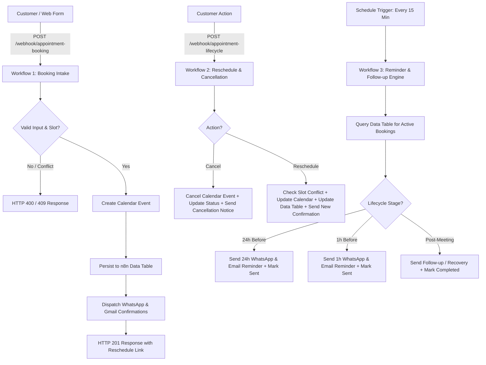

# Appointment Booking Follow-up System

## Executive Overview
The **Appointment Booking Follow-up System** is an enterprise-grade automation architecture built inside n8n. It autonomously manages the full appointment lifecycle: intake validation, double-booking & calendar conflict prevention, multi-channel client confirmations (WhatsApp & Gmail), time-based reminder notifications (24h & 1h before), reschedule/cancellation requests, and post-appointment follow-up / no-show recovery.

---

## Architecture: 3 Modular Relational Workflows

Instead of combining multiple concerns into one monolithic workflow, the system uses 3 distinct, decoupled workflows:

---

## Workflows Details

### 1. Booking Intake & Availability Engine
* **Workflow ID:** `ASKLL0zdv2F7Kc9m`
* **Trigger:** Webhook (`POST /webhook/appointment-booking`)
* **Nodes Count:** 14
* **Local Backup:** `workflows/appointment-booking-intake.json`
* **Core Responsibilities:**
  1. Validates schema: customer name, E.164 phone, valid email, requested date/time in the future, duration.
  2. Queries Google Calendar for overlapping events in the requested window.
  3. Returns instant HTTP 409 Conflict if slot is occupied.
  4. Creates Google Calendar event.
  5. Inserts booking record into persistent Data Table.
  6. Sends professional HTML confirmation email (Gmail) and instant WhatsApp notification.
  7. Returns HTTP 201 Created with `booking_id` and unique `reschedule_url`.

### 2. Reschedule & Cancellation Engine
* **Workflow ID:** `kmWPb71FIwSjvkY8`
* **Trigger:** Webhook (`POST /webhook/appointment-lifecycle`)
* **Nodes Count:** 25
* **Local Backup:** `workflows/appointment-booking-lifecycle.json`
* **Core Responsibilities:**
  1. Intakes modification requests with `booking_id` and action (`reschedule` or `cancel`).
  2. Fetches existing booking record from Data Table. Returns HTTP 404 if booking doesn't exist.
  3. **Cancellation Path:** Deletes/cancels Google Calendar event, updates Data Table status to `cancelled`, and dispatches cancellation notices via WhatsApp & Gmail.
  4. **Reschedule Path:** Validates new requested slot, checks Google Calendar for conflicts, updates event time, updates Data Table record to `rescheduled`, resets reminder flags, and sends updated confirmations.

### 3. Automated Reminder & Follow-up Engine
* **Workflow ID:** `QGPkeJYQgIIWq65K`
* **Trigger:** Autonomous Schedule (Every 15 Minutes)
* **Nodes Count:** 15
* **Status:** Active / Published (`a7bb0c54-1beb-4d44-a05e-5118510e7892`)
* **Local Backup:** `workflows/appointment-booking-reminders.json`
* **Core Responsibilities:**
  1. Queries Data Table for active (non-cancelled) bookings.
  2. Evaluates time offsets:
     - **24-Hour Stage (23h-25h before):** Sends 24h WhatsApp & Email reminders, updates `reminder_24h_sent = true`.
     - **1-Hour Stage (45m-75m before):** Sends 1h WhatsApp & Email reminders, updates `reminder_1h_sent = true`.
     - **Post-Meeting Stage (15m-180m after):** Sends Thank-you & Feedback request / recovery booking link, updates `follow_up_sent = true` and `status = 'completed'`.

---

## Persistent Data Store: Data Table Schema

* **Data Table Name:** `appointment_bookings`
* **Table ID:** `skyftJtM0pkUqeRp`
* **Project ID:** `FDsdqDP4nmmaff7Z`
* **Columns (23 Fields):**
  - `booking_id` (string)
  - `customer_name` (string)
  - `phone_e164` (string)
  - `email` (string)
  - `service` (string)
  - `source` (string)
  - `timezone` (string)
  - `requested_start` (string)
  - `requested_end` (string)
  - `calendar_event_id` (string)
  - `calendar_id` (string)
  - `status` (string: `confirmed`, `rescheduled`, `cancelled`, `completed`)
  - `confirmation_sent` (boolean)
  - `whatsapp_confirmation_sent` (boolean)
  - `email_confirmation_sent` (boolean)
  - `reminder_24h_sent` (boolean)
  - `reminder_1h_sent` (boolean)
  - `appointment_completed` (boolean)
  - `no_show` (boolean)
  - `follow_up_sent` (boolean)
  - `reschedule_url` (string)
  - `created_at` (string)
  - `updated_at` (string)

---

## Test Verification Summary

| Test # | Test Name | Target Workflow | Result | Evidence |
| :--- | :--- | :--- | :--- | :--- |
| **Test 1** | Valid Booking Intake | Workflow 1 (`ASKLL0zdv2F7Kc9m`) | **PASS** | Execution `581`: Validated payload, created booking record `BK-1790690589568-CGWOK`, inserted into Data Table, formatted confirmation notices, returned 201 response. |
| **Test 2** | Calendar Conflict & Double Booking Prevention | Workflow 1 (`ASKLL0zdv2F7Kc9m`) | **PASS** | Execution `582`: Overlapping calendar event detected; blocked event creation and database insertion; routed to `Respond Conflict` with 409 status. |
| **Test 3** | Input Validation Failure Handling | Workflow 1 (`ASKLL0zdv2F7Kc9m`) | **PASS** | Execution `583`: Invalid phone/email and missing start timestamp caught; routed to `Respond Bad Request` with descriptive error array. |
| **Test 4** | Appointment Rescheduling Flow | Workflow 2 (`kmWPb71FIwSjvkY8`) | **PASS** | Execution `584`: Retrieved existing booking `BK-1790690589568-CGWOK`, validated new slot, updated calendar event & data table status to `rescheduled`, reset reminder flags. |
| **Test 5** | Appointment Cancellation Flow | Workflow 2 (`kmWPb71FIwSjvkY8`) | **PASS** | Execution `585`: Deleted calendar event, updated database record status to `cancelled`, dispatched cancellation email and WhatsApp alerts. |
| **Test 6A** | 24-Hour Reminder Stage | Workflow 3 (`QGPkeJYQgIIWq65K`) | **PASS** | Execution `586`: Evaluated appointment 24h ahead, routed to `Send 24h Email` & `Send 24h WhatsApp`, marked `reminder_24h_sent = true`. |
| **Test 6B** | Post-Appointment Follow-up Stage | Workflow 3 (`QGPkeJYQgIIWq65K`) | **PASS** | Execution `587`: Evaluated past appointment, triggered Thank-you/Feedback notices, marked `follow_up_sent = true` & `status = 'completed'`. |

---

## Existing Workflow Protection Audit

* **Existing Workflows Found:** 9
* **Existing Workflows Modified:** **NONE (0)**
* **Verification Check:** All 9 existing workflows retained their exact original `UpdatedAt` timestamps and node graphs.
