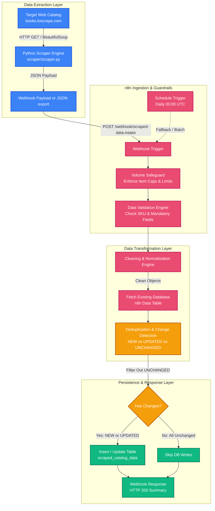

# 🏗️ Web Scraping + Data Cleaning Pipeline Architecture

This document provides a comprehensive technical overview of the **Web Scraping + Data Cleaning Pipeline**, detailing the system components, data flow, transformation rules, deduplication logic, and persistent storage schema.

---

## 1. System Overview

The **Web Scraping + Data Cleaning Pipeline** is an automated ETL (Extract, Transform, Load) system designed to reliably harvest unstructured or semi-structured data from target web sources, clean and normalize inconsistent fields in **n8n**, detect changes/deduplicate against existing catalog records, and store clean structured datasets into persistent storage.



---

## 2. Component Specifications

### 2.1 Python Scraper Layer (`scraper/scraper.py`)
- **Technology:** Python 3.10+, `requests`, `BeautifulSoup4`.
- **Target Source:** `http://books.toscrape.com/` (Public bookstore catalog with 1,000+ items across 50 categories).
- **Extraction Logic:**
  - Traverses catalog pages and individual product detail pages.
  - Extracts unique product SKU / identifier (e.g., `a897539b105326b6`).
  - Extracts raw product title, breadcrumb category, raw price string (`£51.77`), star rating (`Three`), stock status (`In stock (22 available)`), product link, and primary image URL.
  - Formats data into a standardized JSON array.
  - Automatically posts scraped items to the n8n intake webhook (`POST /webhook/scraped-data-intake`) with a fallback option to save locally (`scraper/scraped_data.json`).

### 2.2 Ingestion & Guardrails Layer
- **Webhook Intake:** `POST /webhook/scraped-data-intake` receives batches of scraped records.
- **Schedule Trigger:** Configured for daily recurring triggers (`00:00 UTC`) for automated autonomous scraping workflows.
- **Volume Safeguard:** Enforces maximum batch limits (caps processing at 500 items per batch) to prevent memory overload or API rate-limiting issues.
- **Data Validation Node:**
  - Validates that every incoming item contains a non-empty `sku` or `product_url`.
  - Discards malformed records missing critical identifying attributes.

### 2.3 Cleaning & Normalization Engine (n8n JavaScript Code)
Raw web data is notoriously dirty. The pipeline runs deterministic normalization functions across every record:

| Field | Raw Extracted Value | Cleaned / Normalized Value | Transformation Logic |
| :--- | :--- | :--- | :--- |
| **`price`** | `"£51.77"`, `"$19.99"` | `51.77` *(Float)* | Regex removes currency symbols & whitespace; parsed via `parseFloat()`. |
| **`currency`** | `"£51.77"` | `"GBP"` *(ISO Code)* | Extracted from currency symbols (`£` → GBP, `$` → USD, `€` → EUR). |
| **`rating`** | `"Three"`, `"Star 4"` | `3`, `4` *(Integer 1–5)* | Maps word representations (`One`=1, `Two`=2, `Three`=3, `Four`=4, `Five`=5). |
| **`in_stock`** | `"In stock (22 available)"` | `true` *(Boolean)* | Lowercased string match for `"in stock"`; defaults to `false` if `"out of stock"`. |
| **`title`** | `"  A Light in the ...  "` | `"A Light in the Attic"` | HTML entities decoded, whitespace collapsed and trimmed. |
| **`category`** | `"Poetry\n"` | `"Poetry"` | Normalized to capitalized, clean category name. |
| **`product_url`** | `"/catalogue/a-light_1000/index.html"` | Absolute URL | Relative paths resolved against `http://books.toscrape.com/`. |

---

## 3. Deduplication & Change Detection Logic

To avoid redundant database writes and prevent bloated datasets, the pipeline implements an **in-memory diffing engine**:

1. **Existing State Retrieval:** The node `Fetch Existing Database` retrieves all current rows from the persistent data table (`scraped_catalog_data`).
   - *Resilience Note:* Configured with `alwaysOutputData: true` so execution continues smoothly even when the database is initially empty.
2. **Lookup Indexing:** Builds a fast hash map indexed by `record_id` (the canonical SKU).
3. **Change Detection:**
   - **`NEW`**: If `record_id` does not exist in the database:
     - Sets `status = 'active'`
     - Sets `first_seen_at = now()`
     - Sets `last_seen_at = now()`
     - Sets `last_changed_at = now()`
     - Flags for database insertion.
   - **`UPDATED`**: If `record_id` exists, but attributes differ (e.g. `price` changed, `in_stock` toggled):
     - Sets `status = 'updated'`
     - Preserves `first_seen_at`
     - Sets `last_seen_at = now()`
     - Sets `last_changed_at = now()`
     - Flags for database update.
   - **`UNCHANGED`**: If `record_id` exists and all tracked attributes match:
     - Sets `status = 'unchanged'`
     - Excluded from downstream write operations to conserve DB quota.

---

## 4. Persistent Storage Schema (`scraped_catalog_data`)

The database table `scraped_catalog_data` (Data Table ID: `jiPLikaVYg9vxrIQ`) uses the following schema:

| Column Name | Data Type | Key / Constraint | Description |
| :--- | :--- | :--- | :--- |
| `record_id` | String | Unique Identifier | Scraped SKU or deterministic MD5 hash |
| `source` | String | Required | Source origin (e.g., `books.toscrape.com`) |
| `title` | String | Required | Cleaned product or listing title |
| `category` | String | Optional | Normalized category classification |
| `price` | Number (Float) | Required | Normalized unit price in numeric format |
| `currency` | String | Required | ISO 4217 currency code (e.g., `GBP`, `USD`) |
| `rating` | Number (Integer) | Optional | Normalized rating score (1 to 5) |
| `in_stock` | Boolean | Required | Availability status (`true` / `false`) |
| `product_url` | String | Unique / URL | Canonical link to source product page |
| `image_url` | String | URL | URL of primary product photograph |
| `status` | String | Enum | Lifecycle status (`active`, `updated`, `archived`) |
| `first_seen_at` | String (ISO 8601) | Timestamp | Timestamp when item was first scraped |
| `last_seen_at` | String (ISO 8601) | Timestamp | Timestamp of most recent scraper pass |
| `last_changed_at` | String (ISO 8601) | Timestamp | Timestamp when price/status last changed |
| `scraped_at` | String (ISO 8601) | Timestamp | Execution timestamp of scraping run |

---

## 5. Webhook Ingestion & Response Protocol

### Webhook Request
- **Endpoint:** `POST https://realestateleadmanagement-n8n-b138c4-13-203-193-36.sslip.io/webhook/scraped-data-intake`
- **Headers:** `Content-Type: application/json`
- **Payload:**
```json
{
  "source": "books.toscrape.com",
  "batch_id": "BATCH-20260930-1035",
  "items": [
    {
      "sku": "a897539b105326b6",
      "title": "A Light in the Attic",
      "category": "Poetry",
      "price": "£51.77",
      "rating": "Three",
      "availability": "In stock (22 available)",
      "product_url": "http://books.toscrape.com/catalogue/a-light-in-the-attic_1000/index.html",
      "image_url": "http://books.toscrape.com/media/cache/2c/da/2cdad67c44b002e7ead0cc35693c0e8b.jpg"
    }
  ]
}
```

### Webhook Response
```json
{
  "success": true,
  "message": "Web scraping pipeline processed successfully",
  "total_received": 10,
  "new_records": 10,
  "updated_records": 0,
  "unchanged_records": 0,
  "timestamp": "2026-09-30T05:35:45.000Z"
}
```

---

## 6. Execution Verification & Proof of Work
- **Live Workflow ID:** `kfiCNxBHNp96exFP`
- **Verified Execution ID:** `#650`
- **Execution Status:** `success`
- **Records Processed:** 10 items ingested, cleaned, deduplicated, and inserted into persistent storage.
